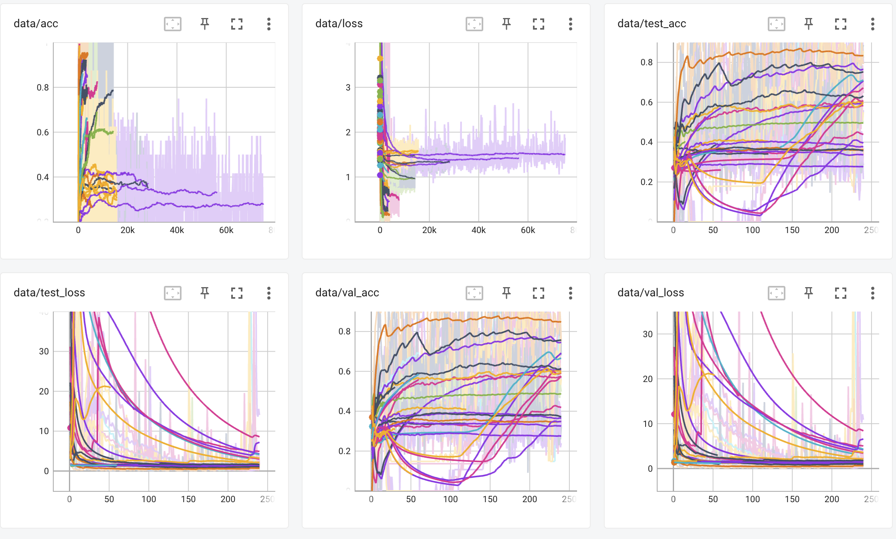

# 'Mundus' EEG Signal Classification Code Base
A convenient code base for build, train and validate deep learning based EEG recgonition networks.
'Mundus EEG' means 'World of EEG' in medieval Latin language (please correct me if there is anything wrong with the meaning.)
Hopefully name will give this repository some fun. 

🌍 Features

1. CTNAS, complete code for cross task neural architecture searching for EEG signals, refer to ```./mundus/models/backbones/DARTS/```
2. Visualization utilities of the searched results, refer to  ```./mundus/visualization/search_visual```
3. Simple data preparation for common Motor Imaginary and Emotion datasets. Current version supports BCI Competition and SEED datasets.
4. Static structure training framework. Current version use EEGNet as example. Network could be easily verified by compose network structure under direction: ```./mundus/models/backbone``` and launch training through ```./mundus/runners/```
5. Training curve visualization through tensorboard.

💻 Installation

The code is basically based on Pytorch 1.12.0, tensorboardX, and mne
Run is follow to prepare the environment of mundus.
```ssh
git clone this repo
cd repodir
pip install -r requirements.txt
```
📖 Data preparation

Considering privacy issue, we do not provide any instant brain dynamics data through this repo.

Download BCI-IV dataset through link [https://www.bbci.de/competition/iv/](https://www.bbci.de/competition/iv/)

Download SEED datasets through link [https://bcmi.sjtu.edu.cn/home/seed/publications.html](https://bcmi.sjtu.edu.cn/home/seed/publications.html)

Then run data preparation scripts in mundus. 

⌚️ Training

The ```./lauch.py``` file contains entry for all the model structures in CTNAS. 

We give example search scripts in `./mix_train_search.py` for mixed-subject searching and `./mix_train_search_retrain.py` for retrain. 


🚗 Training example visualization

The training example on BCI-IV datasets:




📒 Citation

The information of original paper is listed below for convenient citation. 


